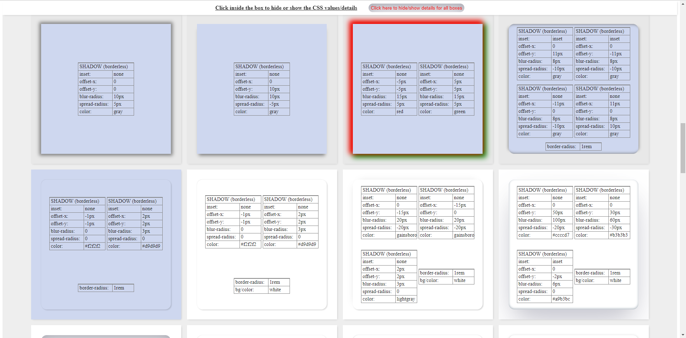

#CSS Box-Shadow Samples

## Idea
To showcase some example code related to CSS box-shadow property working.

## Technlogies Used
 1. HTML (usage: 1300 lines - 69.51%)
 2. CSS (usage: 513 lines - 27.43%)
 3. JavaScript (very little usage: 57 lines) 

### Screenshot

